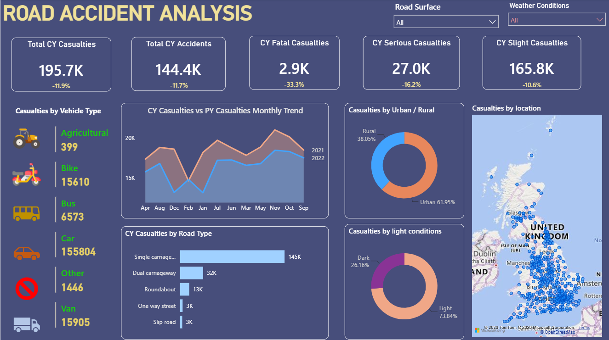

# Road Accident Analysis Dashboard

This Power BI dashboard provides comprehensive insights into road accident trends, casualty statistics, vehicle involvement, road conditions, and accident severity.

The dashboard helps stakeholders identify accident patterns and supports data-driven decision-making for improving road safety.

---

## 🎯 Objectives

- Analyze total casualties and accidents.
- Compare current year and previous year casualty trends.
- Identify high-risk road types and locations.
- Analyze accidents based on:
  - Vehicle type
  - Road type
  - Road surface condition
  - Urban vs Rural areas
  - Daylight conditions
- Provide interactive visualizations for better insights.

---

## 📊 Key KPIs

- Total Casualties
- Fatal Casualties
- Serious Casualties
- Slight Casualties
- Current Year vs Previous Year Comparison
- Monthly Casualty Trends

---

## 📈 Dashboard Features

### 1. Casualty Overview
- Total casualties
- Fatal casualties
- Serious casualties
- Slight casualties

### 2. Vehicle Type Analysis
- Cars
- Buses
- Bikes
- Vans
- Tractors
- Other vehicles

### 3. Road Type Analysis
- Single carriageway
- Dual carriageway
- Roundabout
- One-way street
- Slip roads

### 4. Area Analysis
- Urban Areas
- Rural Areas

### 5. Road Surface Analysis
- Dry
- Wet
- Snow/Ice

### 6. Light Condition Analysis
- Daylight
- Darkness

---

## 🛠 Tools & Technologies

- Power BI Desktop
- Power Query
- DAX
- Data Modeling
- Excel Dataset

---

## 📷 Dashboard Preview

---

## 📊 Insights Generated

- Majority of casualties are caused by car-related accidents.
- Urban areas contribute significantly to total accidents.
- Single carriageways show the highest accident frequency.
- Accident patterns vary based on road surface and lighting conditions.
